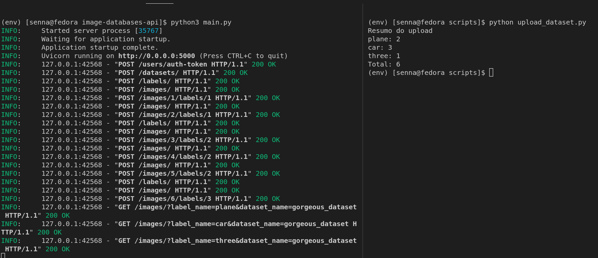

# Rodando o script

Na pasta scripts do projeto existe um exemplo de interação com a api. Ele irá fazer o upload de uma parsta contendo uma base de imagens.

É muito comum que bases de imagens utilizadas para a classioficação sejam disponibilizadas em uma pasta contendo outras pastas. Essas pastas internas representam as classes das imagens que  estão dentro delas.

O script *upload_dataset.py* pega uma pasta com esse formato, cria uma base de imagens na api e para cada uma das pastas internas ele cria uma label com o nome da pasta e faz o upload das imagens dentro dela para a base de dados, a marcando com a label da pasta.

As configuração do script são feitas por variávei de ambiente, por padrão ele vai fazer o upload da base na pasta *example* que contém 3 classes e 6 imagens.

## Configurações

* **USER_MAIL**(Padrão: admin@mail.com): Email do usuário que será utilizado para fazer login na api.
* **USER_PASSWORD**(Padrão: admin): Senha do usuário para fazer login na api.
* **DATASET_DIRECTORY**(Padrão: ./example): Caminho para a pasta da base de dados
* **API_URL**(Padrão: http://127.0.0.1:5000): URL da api
* **DATASET_NAME**(Padrão: gorgeous_dataset): Nome da base que será criada na api

## Rodando o script

Na raiz do projeto crie um venv e instale as dependências do projeto.

```
python3 -m venv env
source env/bin/activate
pip3 install -r requirements-dev.txt

```

Coloque a api para rodar e verifique que a url para acessá la.

Depois entre na pasta do script e o execute com esses comandos:

```
cd scripts
python3 upload_dataset.py
```

Caso queira mudar as variáveis, utilize essa estratégia:

```
API_URL=localhost:8080 USER_MAIL=asd@mail.com python3 upload_dataset.py 
```

Exemplo da saída gerada:

