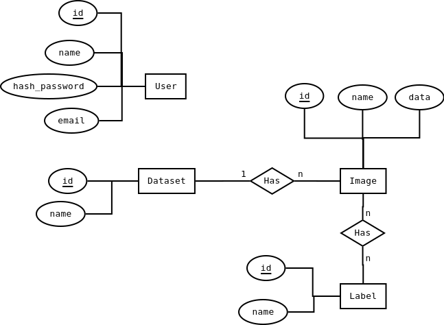

# Modelagem da api

## Diagrama ER

## Entidades

### User

Usuário da api, possui os seguintes atributos:

* id: Chave.
* nome: nome do usuário.
* email: email do usuário com validação de formato.
* hash_password: Password do usuário hasheado, método de login por usuário e senha.

### Dataset

### Image

### Label